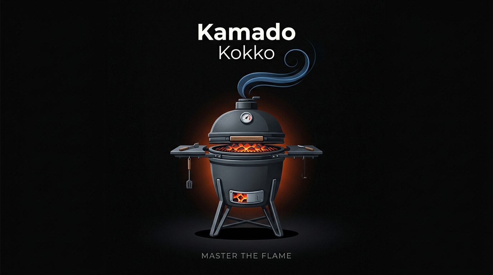

# Kamado — Livre de recettes & Guide universel



Application web progressive (PWA) et mobile native (Capacitor) de recettes, d'assistance thermique et de sommellerie pour tous les passionnés de cuisine au barbecue céramique Kamado (Big Green Egg, Kamado Joe, Monolith, Primo, The Bastard, etc.).

**Application en ligne** : [https://qevedeveq-art.github.io/kamado/](https://qevedeveq-art.github.io/kamado/)

---

## 🔥 Fonctionnalités Majeures

L'application est conçue pour être **ultra-rapide, 100 % utilisable hors-ligne (Offline-First)** et spécifiquement adaptée aux conditions réelles de cuisson en extérieur :

### 🍽️ Livre de Recettes Gastronomiques (269 recettes)
* **246 recettes de cuisson et 23 sauces & bases** couvrant l'ensemble des techniques du kamado : saisie directe à haute température, rôtissage indirect, fumage *Low & Slow*, cuisson sur pierre à pizza, cocotte en fonte et plancha.
* **100 % enrichies** : chaque fiche comporte les réglages d'évents (haut/bas), les besoins en charbon (kg), les phases de cuisson structurées, la température à cœur exacte, l'équipement requis, les allergènes certifiés (norme UE) et les accords mets-vins.
* **Navigation fluide & tactile** : feuilletage des recettes via des flèches `‹` / `›`, touches fléchées du clavier et geste de balayage tactile (*swipe*) sur smartphone.
* **Liens permanents** : chaque recette possède un identifiant stable ; les liens partagés et QR codes ouvrent directement la bonne fiche, y compris après une recharge hors ligne.
* **Recherche intelligente & synonymes BBQ** : moteur multi-mots avec tolérance aux synonymes courants (ex: *ribs* trouve les travers, *brisket* trouve la poitrine, *effiloché* trouve le pulled pork).
* **Recherche experte** : guillemets pour une expression exacte, exclusions avec `-porc`, et filtres de champ comme `cat:boeuf`, `mode:fumage`, `bois:chene`, `ingredient:citron`, `source:franklin` ou `temp:110`.
* **Parcours éditoriaux** : sélections « Premiers feux », « Les signatures », « Low & Slow » et « Fiches de référence » pour entrer dans le catalogue par intention plutôt que par catégorie.
* **Pilules de filtres rapides** : accès direct en 1 tap aux cuissons `⚡ < 30 min`, `🔥 Saisie vive`, `🛡️ Four indirect`, `💨 Low & Slow`, `🍕 Pizza & Pains`, `🌿 Végétarien` et `⭐ Favoris`.

### 📚 Bibliothèque éditoriale indexable

* **269 fiches recette statiques** avec URL canonique, ingrédients, étapes, réglages, sécurité, sources et lien direct vers le mode cuisson interactif.
* **Catalogue sans JavaScript** à [`/recettes/`](https://qevedeveq-art.github.io/kamado/recettes/) et dossiers de référence à [`/guides/`](https://qevedeveq-art.github.io/kamado/guides/).
* **SEO vérifiable** : métadonnées sociales, données structurées `WebPage`/`Article`/`ItemList`, `sitemap.xml` et `robots.txt` générés depuis la même source que l'application.
* Le balisage enrichi `Recipe` reste volontairement désactivé tant que chaque recette ne dispose pas d'une photographie représentative du plat fini.

### 🚀 Cook Engine 2.0 — Cockpit de cuisson guidée
* Conçu pour cuisiner les mains occupées à 2 mètres du kamado :
  * **Typographie géante et contraste maximal** (noir profond et orange braise éclatant).
  * Plan de cuisson généré depuis les phases structurées de la recette, avec repli sur ses étapes lorsqu'elles ne sont pas disponibles.
  * Rappel permanent de la **température dôme cible**, de la **température à cœur** et du **montage déflecteur**.
  * **Minuteur absolu persistant** : une cuisson reprend au bon instant après fermeture, rechargement ou passage de l'application en arrière-plan.
  * Relevés manuels dôme/cœur et conseils prudents de stabilisation, sans prétendre piloter automatiquement les évents.
  * Session active visible dès l'accueil, sauvegardée localement et incluse dans les exports/transferts de données.
  * Fin de cuisson journalisée automatiquement dans le **Journal de Braises**.
  * **Maintien de l'écran allumé automatique** (Screen Wake Lock API) pour éviter toute mise en veille.
  * **Alertes sonores et retour haptique** (vibrations smartphone à l'échéance).

L'intégration de sondes connectées reste volontairement hors de cette phase : elle fait partie de la future couche d'intégrations matérielles, indépendante des marques.

### 🚨 Module « SOS Kamado & Dépannage Express »
* Accès d'urgence immédiat en cas d'aléa thermique :
  * *Température qui s'emballe (> 200 °C)* ➔ Procédure de fermeture étagée sans étouffement explosif.
  * *Chute de température / braises éteintes* ➔ Débouchage du panier à charbon par la trappe basse.
  * *Fumée blanche âcre persistante* ➔ Relance de la combustion et évacuation de la créosote.
  * *Pizzas brûlées dessous* ➔ Montage 3 étages (déflecteur + rehausseur + pierre sous la voûte).
  * *Le « Stall » (plateau d'évaporation à 65–70 °C)* ➔ Méthode de béquillage serré (*Texas Wrap*).
  * *Flammes soudaines à l'ouverture* ➔ Réflexe impératif du « Burp » (anti-flashback).

### 🍷 Guide & Accords Vins de Haute Sommellerie
* Élaboré selon les principes de **Philippe Faure-Brac** (Meilleur Sommelier du Monde 1992, UDSF), d'**Olivier Poussier** et de la **Revue du Vin de France (RVF)** :
  * **Les 5 Lois d'Or des accords au feu de bois** (Réaction de Maillard vs tannins, fumée vs cépages fruités, gras vs tension acide, sauces douces vs sucres résiduels, températures de service en extérieur).
  * **Explorateur interactif d'accords** par familles et recherche de cépages/appellations.
  * **Carte Sommelier intégrée dans chaque recette** : accord d'élite (AOC/cépage), alternative accessible, explication gustative et température de service précise.
  * Accords bières artisanales (Craft Beer) et cidres fermiers.

### ⚖️ Calculateur de Rubs & Dosage du Sel au Gramme Près
* Calculateur d'assaisonnement basé sur le poids exact de la pièce crue :
  * Application stricte de la **règle des 1,0 à 1,1 % de sel** pour sublimer la viande sans jamais la sursaler.
  * Profils préenregistrés : *Texas Dalmatian Rub* (sel casher / poivre 16 mesh), *Memphis Sweet & Smoky*, *Herbes & Ail de Provence*.

### 📲 Partage Instantané par QR Code Hors-Ligne
* Générateur de QR Code SVG 100 % autonome en JavaScript pur (sans dépendance externe ni connexion réseau).
* Vos convives flashent directement l'écran de votre smartphone pour ouvrir la recette complète sur leur propre appareil.

### 📖 Mon Journal de Braises (Historique Consolidé)
* Centralisation de toutes vos sessions de cuisson passées : découpes, essences de bois de fumage testées, durées réelles, températures finales, notes personnelles et retours d'expérience.

### 🛠️ Équipement Nécessaire Haute Visibilité
* Encadré en dégradé contrasté à liseré doré ambré avec badges distincts blancs sur fond surélevé, et rappel direct dans la barre de caractéristiques d'en-tête.

### 📅 Rétroplanning & Gestion de Session
* **Timeline inversée** : indiquez votre heure de repas cible (ex: 13h00) pour obtenir l'horaire précis d'allumage, de mise en place du déflecteur, d'enfournement et de repos sous alu.
* **Liste de courses consolidée par rayons** : Boucherie & Poissonnerie, Primeur, Épicerie & Épices, cochable et persistée localement.

---

## 📲 Installation Mobile (PWA & Hors-Ligne)

L'application fonctionne à 100 % hors connexion grâce aux Service Workers :

* **Sur iPhone / iPad** : Ouvrez le site dans Safari, touchez le bouton *Partager*, puis sélectionnez **Sur l'écran d'accueil**.
* **Sur Android** : Ouvrez dans Chrome, touchez le menu ⋮ puis **Installer l'application**.
* **Sur Ordinateur (Mac / Windows / Linux)** : Ouvrez dans Chrome ou Edge, puis cliquez sur l'icône d'installation dans la barre d'adresse.

---

## 🔬 Suite d'Audit Multi-Agents & Qualité du Code

Le projet intègre des contrôles automatisés sur les données, l'expertise culinaire, la PWA et ses parcours critiques :

```bash
npm test                    # 73 tests natifs (node --test)
npm run audit               # Données, métier, éditorial/SEO et budget PWA
npm run audit:editorial     # Fiches canoniques, guides, sitemap et robots
npm run audit:quality       # Revue transverse de la qualité des recettes
node scripts/browser-smoke.js # Chromium : recherche, Cook Engine persistant, QR et offline
```

Le smoke test navigateur attend le paquet `playwright` dans `NODE_PATH`. La CI l'installe dans un répertoire temporaire afin de préserver l'architecture zéro-build du projet.

Les fichiers de `data/`, `recettes/`, `guides/`, `sitemap.xml` et `robots.txt` sont dérivés de `index.html`. Après toute modification des recettes ou des guides, régénérez-les ensemble :

```bash
node scripts/extract-data.js
```

---

## 📦 Schéma d'une Fiche Recette

Chaque recette s'appuie sur le schéma enrichi du Kamado :

| Champ | Type | Description |
|-------|------|-------------|
| `id` | `string` | Identifiant permanent utilisé dans les liens et QR codes |
| `nom` | `string` | Titre unique et gastronomique |
| `cat` | `string` | Catégorie (`boeuf`, `porc`, `volaille`, `agneau`, `poisson`, `legumes`, `pizza`, `monde`, `dessert`, `sauces`) |
| `mode` | `string` | Configuration (`Direct`, `Indirect`, `Fumage lent`, `Plancha`, `Four à pizza`, `Braisage cocotte`) |
| `tempK` | `string` | Plage de température dôme kamado (ex: `110–120 °C`) |
| `coeur` | `string` | Température à cœur cible de sortie (ex: `54 °C saignant`) |
| `phases` | `array` | Découpage multi-températures (`name`, `mode`, `temp_C`, `duration_min`, `action`) |
| `vents` | `object` | Réglage indicatif des évents (`bottom`, `top`) |
| `charbon_kg` | `number` | Consommation de charbon estimée |
| `repos_min` | `number` | Temps de repos sous papier d'aluminium pour redistribution des sucs |
| `equipement` | `string[]` | Accessoires requis (`déflecteur`, `sonde`, `pierre`, `plancha`, etc.) |
| `notes_securite` | `string[]` | Règles d'hygiène et seuils thermiques critiques |
| `substitutions` | `array` | Alternatives d'ingrédients (`ingredient`, `par`) |
| `erreurs` | `string[]` | Pièges fréquents à éviter |
| `source` | `string` | Références d'inspiration (Aaron Franklin, Meathead Goldwyn, Elkano, etc.) |

---

## 📜 Licence

Projet open-source partagé pour la communauté des passionnés de cuisine au feu de bois et barbecue céramique.
